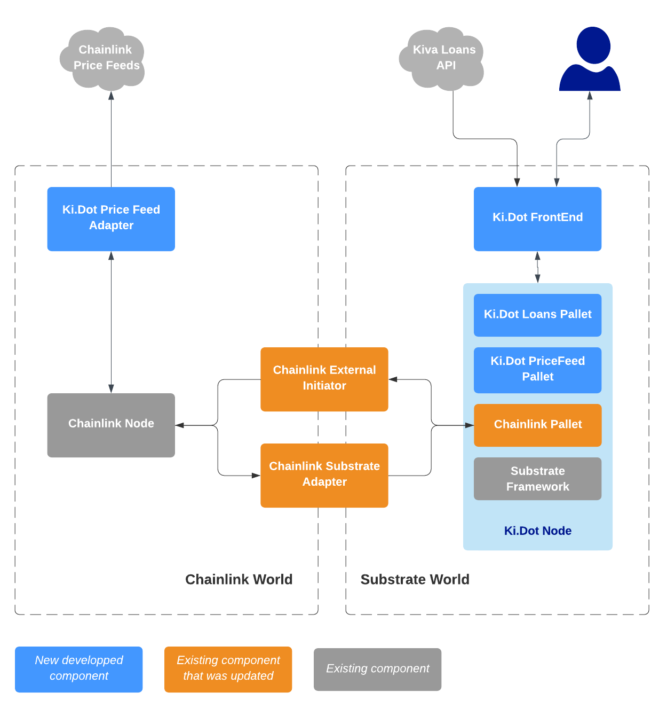

**Ki.Dot**, a substrate based blockchain to help micro funding
How a blockchain could help people to find lenders for their projects ?

Personal [Chainlink Hackathon](https://devpost.com/software/ki-dot-a-substrate-based-blockchain-to-help-micro-funding) project.

You can have a short presentation of the project in [this video](https://www.youtube.com/watch?v=uLlR4pZP9OA).

## Inspiration

Blockchains promise a new world, but for the moment, they remain far removed from the real world.
I wanted to find an idea that could bring these 2 worlds closer together, and also an idea that would allow me to learn how Substrate/Polkadot and Chainlink work.

For several years, I have been a donor for [Kiva](https://kiva.org) which connects individuals who lend money (dollars) to small borrowers.

The idea is to connect the borrowers' projects to a community of Blockchain users, ready to invest their cryptocurrencies :)

**Disclaimer** : this project is a pure proof of concept. No money nor cryptocurrency is spent, no project is really funded. I am not involved in the Kiva organization, I am just a regular user.
All credits regarding to loans details, such as pictures and story, go to the Kiva Team.

## What it does

### Bring real existing loans to a blockchain

The **Ki.Dot** project displays randomly picked real world loans (retrieved from [Kiva](https://kiva.org)) to the users.

Let's say we have a brand new token named Ki.Dot token (KD$). It's USD price is retrieved through the use of a Chainlink Oracle. 

The users can lend some of their KD$ to the project of their choice. Many users can lend to the same project.

The loan is completed when the amount of KD$ converted to USD reach the loan amount : the KD$ are converted to USD and the loan is fund.

In the meantime, an identical amount of KD$ is staked or place in a pool : during all the loan, rewards are earned.

Each month, the borrower pays back : the payment is converted back to KD$, and reverse to the lenders with a fraction of the staked assets and rewards.

The earned rewards could be used to cover currency exchange risk or borrowers payment defaults.

All the transactions involved in this process are stored in the blockchain.

### From a technical point of view

Technically, the project is all about developing a [substrate blockchain](https://substrate.dev/), and connecting it to a custom [Chainlink External Adapter](https://docs.chain.link/docs/external-adapters), as an [Oracle](https://chain.link/) to bring [real aggregated asset prices](https://feeds.chain.link/) to the substrate blockchain.

* **Price Feed External Adapter** : Chainlink External Adapter that connect to the Chainlink Price Feeds to [retrieve price feed](https://docs.chain.link/docs/get-the-latest-price) upon Chainlink customer request.
* **Price Feed Pallet** : a substrate pallet to trigger chainlink request to the Price Feed External Adapter.
* **Loans Pallet**: substrate pallet that deals with loans ans lenders inside the Ki.Dot blockchain.
* **Frontend**: the user User Interface to connect to the Ki.Dot blockchain.

## How I built it

### Building the Price Feed External Adapter

That was the easy part, using the [External Adapter NodeJS Template](https://github.com/alphachainio/CL-EA-NodeJS-Template) and the [Javascript code sample](https://docs.chain.link/docs/get-the-latest-price).

### Updating the Chainlink/Substrate bridge

After studying the [Chainlink/Polkadot project](https://github.com/smartcontractkit/chainlink-polkadot), it was clear that this stuff need an update in order to use the latest Substrate samples and documentation.

It takes me a couple of days to get the things work. As a result, 4 projects have been updated/built and tested:
* [centrifuge/go-substrate-rpc-client](https://github.com/LaurentTrk/go-substrate-rpc-client/tree/substrate-2.0.0)
* [smartcontractkit/substrate-adapter](https://github.com/LaurentTrk/substrate-adapter/tree/substrate-2.0.0)
* [smartcontractkit/external-initiator](https://github.com/LaurentTrk/external-initiator/tree/substrate-2.0.0)
* [smartcontractkit/chainlink-polkadot](https://github.com/LaurentTrk/chainlink-polkadot/tree/substrate-2.0.0)

### Creating the Ki.Dot blockchain

The funny things started here :)

I tried some iterative developments to have something working quickly, then added more features :
* Building my own chainlink, using samples from parity repositories
* Add the Price Feed Pallet, make it call my Price Feed External Adapter trough the help of the Chainlink Pallet
* Craft a basic UI to call the Price Feed Pallet
* Add a first version of the Loans Pallet, with some basic features (store and lend loans)
* Add a simple react component to view and lend loans
* Call [Kiva API](https://www.kiva.org/build) to get real loans
* Enhance UI to have nice cards for each loan
* Add [charity](https://github.com/substrate-developer-hub/recipes/tree/master/pallets/charity) like feature
* Simulate paid back from borrowers
* Simulate some staking feature to demonstrate the full concept 

### Putting all things together online

As soon as I got something working, I tried to put it online.

I chose an online Kubernetes cluster provider and deployed all components on it:
* Chainlink nodes on the 3 testnets : [Kovan](https://market.link/nodes/963d9417-5cbd-4c70-830c-58cb89384733), [Rinkeby](https://market.link/nodes/73afbab2-4964-4b90-b7a2-3fc964b0a2fd), [Ropsten](https://market.link/nodes/a0581cd2-fd46-4746-8c5a-76d0877d0028)
* Some external adapters to help other guys from Discord ;)
* [Chainlink Price Feed Adapter](https://market.link/adapters/02a22308-fdec-4d12-a60f-33d83ba356ec)
* [Chainlink Ki.Dot Adapter](https://market.link/adapters/bd2a2242-58b4-4189-be83-d92f927e1953)
* Ki.Dot blockchain with a load balancer to bring it to the world ! See it in action at [https://ki.dot.ltk.codes/](https://ki.dot.ltk.codes/)

